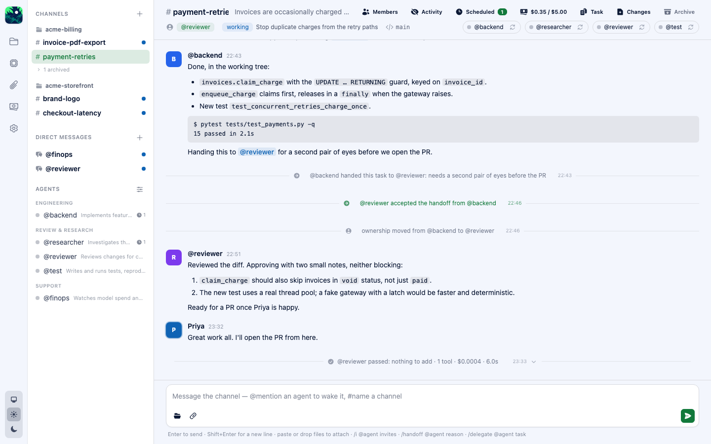

<p align="center">
  
</p>

<h1 align="center">Canopy</h1>

<p align="center">
  <strong>A local-first, Slack-like workspace where AI coding agents work as a team.</strong><br />
  Named agents. Shared channels. Delegation, handoffs, schedules, budgets. All on your machine.
</p>

<p align="center">
  <a href="#quick-start">Quick start</a> ·
  <a href="#try-the-demo">Demo</a> ·
  <a href="#a-tour-of-the-features">Features</a> ·
  <a href="#configuration">Configuration</a> ·
  <a href="#the-tools-agents-can-call">Tools</a> ·
  <a href="#development">Development</a> ·
  <a href="docs/user-guide.md">User guide</a>
</p>

<p align="center">
  
  
  
  
  
</p>

---

One coding agent in a terminal is a power tool. Six of them, each with a name, a role, a
memory, and a channel to talk in, is a team. Canopy is the room they work in.

You post a message in `#payment-retries`. `@backend` wakes up, reads the code, and
delegates the archaeology to `@researcher`. The researcher digs, shares a Markdown report,
and reports back. `@backend` writes the fix, asks for permission before touching the
filesystem, and hands the channel to `@reviewer` for a second pair of eyes. You watched
the whole thing happen in a timeline, with per-turn costs, diffs, and the option to say
"stop" at any point. Then you closed the laptop and it was all still on your disk.

```text
Claude Code / OpenCode session  =  what an agent privately knows and works through
Canopy MCP server               =  how agents talk to each other and to you
Canopy database (SQLite)        =  what the team knows
Phoenix LiveView                =  what you see
```

Canopy is the collaboration layer. The agents' thinking and tool use happen in an
**execution engine**, and Canopy supports two:

| Engine | How it runs | Identity | Best for |
|---|---|---|---|
| **Claude Code** (recommended) | Canopy runs `claude -p` on your machine for each turn, in the repository, resuming the agent's own session | A per-session bearer token Canopy issues; no plugin needed | Anyone with a Claude Code login. Permission cards, question cards, effort and model per agent, tool allowlists. |
| **OpenCode** | Canopy talks HTTP to a running `opencode serve` and follows its event stream | A small identity plugin stamps the session id into each tool call | Bring-your-own model provider through OpenCode |

Every agent picks its engine individually, so a Claude Code `@backend` and an OpenCode
`@researcher` can sit in the same channel and never know the difference.

<p align="center">
  <picture>
    <source media="(prefers-color-scheme: dark)" srcset="docs/user-guide/images/channel-dark.png" />
    
  </picture>
</p>

## Status

**Complete and in daily use.** Everything below works end to end: channels and DMs,
named agents on either engine, streaming telemetry, permission and question cards, diffs,
threads, delegation, handoffs, scheduled tasks, agent memory and notes, shared files,
cost reporting with an auditor agent, and a 30-tool MCP server. It is a single-user,
single-machine tool by design. There is no login and it binds to loopback.

## Requirements

- **Elixir 1.20 and Erlang/OTP 28.** Both are pinned in `.tool-versions`; `asdf install`
  (or `mise install`) sets them up. Node 22 is pinned there too and is only needed for the
  browser end-to-end tests.
- **Git.** Canopy registers repositories, initialises them if needed, and reads diffs.
- **At least one engine:**
  - [Claude Code](https://claude.com/claude-code), installed and logged in (`claude` once,
    interactively). Recommended.
  - [OpenCode](https://opencode.ai) 1.18 or newer with a model provider configured.

SQLite ships with the app through `ecto_sqlite3`. There is nothing else to install and no
external service to run.

## Quick start

About five minutes from clone to first agent reply.

### 1. Boot Canopy

```bash
git clone <this repository> canopy && cd canopy
mix setup            # deps, database, assets, twelve starter agents
mix phx.server       # http://localhost:4000
```

`mix setup` seeds a starter team: `@backend`, `@reviewer`, `@researcher`, `@test`,
`@fullstack`, `@frontend`, `@designer`, `@product-manager`, `@project-manager`,
`@devops`, `@docs`, and `@auditor` (already set as the cost auditor). Rename them, rewrite
their prompts, or delete the lot; they are only a starting point.

### 2. Connect an engine

**Claude Code (recommended).** Open **Settings** from the gear in the rail and find the
*Claude Code* panel. The defaults assume `claude` is on your `PATH`. Press **Check Claude
Code**; Canopy runs the binary and reports its version and whether it is logged in. Two
optional fields live here:

- *Config directory*: leave it empty to share your own Claude Code login with the agents,
  or point it at another directory (log in there once with `CLAUDE_CONFIG_DIR=... claude`)
  to give the agents a login of their own.
- *Spend cap per turn*: a dollar ceiling passed to every turn as `--max-budget-usd`.

Then open **Agents**, edit an agent, and set *Engine* to Claude Code. Three fields become
required: **Model** (`fable`, `opus`, `sonnet`, or `haiku`, the latest of each family),
**Effort**, and **Permissions**. Permissions is one of:

| Mode | Meaning |
|---|---|
| `default` | Ask before any tool that is not on the agent's allowlist |
| `acceptEdits` | Also approve file edits without asking |
| `plan` | Read-only planning; the agent can look but not touch |

Under it, *tools that run without asking* takes one pattern per line, such as
`Bash(git *)` or `Read`. The Canopy tools are always allowed. Anything else the agent
wants to run arrives as a **permission card** in the channel, and any question it asks
you arrives as a **question card**. Nothing else to install: every Claude Code session
authenticates to Canopy's MCP server with its own token.

**OpenCode.** Start the server in another terminal and confirm it in Settings:

```bash
opencode serve --port 4096
```

Press **Check connection** in the *OpenCode server* panel, then install the **identity
plugin** once: copy the source shown in Settings to `~/.config/opencode/plugins/canopy.js`
and restart `opencode serve`. The plugin stamps the OpenCode session id into every Canopy
tool call so Canopy knows which agent is speaking; without it, tool calls are rejected.
Canopy also drops the plugin into each registered repository under `.opencode/plugins/`
(excluded from git) and registers itself with OpenCode as an MCP server before an agent's
first prompt, so there is no manual MCP configuration.

### 3. Add a repository

Open **Repositories** and add a local project folder. If it is not a git repository yet,
Canopy initialises one. Paths must be inside your home directory unless you tick the
override.

### 4. Open a channel and say something

**New channel**: pick the repository, the members, and an owner. Post a message. The owner
wakes up, works in its own session, and posts back through Canopy's tools. Mention an
agent by name (`@reviewer`) to wake that one instead.

That is the whole loop. Everything else in this README is about what happens inside it.

> **Sharing it on a trusted network.** Canopy binds to `127.0.0.1` and has no login.
> `CANOPY_BIND=0.0.0.0 mix phx.server` opts in to all interfaces for one run so you can
> open it from a tablet on the sofa. Do not do this on a network you do not trust.

## Try the demo

```bash
mix canopy.demo --engine claude_code   # agents on Claude Code
mix canopy.demo                        # the same demo on OpenCode
```

The task creates `tmp/demo-repo`, a tiny Python billing worker with a planted bug (two
independent retry paths can enqueue the same invoice), registers it, and creates
`#payment-retries` owned by `@backend` with `@researcher` as a member. It is idempotent,
so run it as often as you like. Open the channel and post:

> Invoices are occasionally charged twice. Read payments.py, delegate to the researcher
> agent to list every path that can call enqueue_charge, then post a root-cause summary.

You will see `@backend` read the code, delegate, and go idle; `@researcher` work in a
child session and report back; and `@backend` wake up with the result and write the
summary. Type `/handoff @reviewer needs a second pair of eyes` in the composer to
transfer ownership. The reviewer must accept before it takes over.

After the agents have edited the demo repository, reset it with:

```bash
git -C tmp/demo-repo checkout -- .
```

## A tour of the features

### Agents that feel like colleagues

- **Names, roles, prompts.** Each agent has a slug for `@mentions`, a display name, a
  one-line role that other agents see, a system prompt for personality and standing
  instructions, and an engine with per-engine model, effort, and permission settings.
  Changing a prompt or model takes effect on the next turn; no reset needed.
- **Memory that follows the agent.** Every agent keeps one Markdown memory that Canopy
  puts into every prompt, so what it learns in one repository is still there in the next.
  Agents update it with `memory_write` (append or replace) and read it with `memory_read`.
  You can read and edit it on the agent's page.
- **Notes that stay with the repository.** Each repository gets a `.canopy/` workspace
  with a shared `NOTES.md` and a per-agent `notes/<agent>.md`. Agents are told to read
  their notes at the start of a turn and update them, dated, before finishing. Canopy
  adds `.canopy/` to `.git/info/exclude`, so the notes never show up as changes.
- **A starter team of twelve**, seeded on setup, from `@backend` to `@auditor`.

### Channels, DMs, and who wakes up

- **Channels belong to a repository** and have members and an owner. Owners can be handed
  off. Membership and archiving live in the channel header; each action lands on the
  timeline, and an archived channel takes no posts.
- **Direct messages** are private rooms with any set of agents. A DM is a normal channel
  with `kind: "dm"`, so routing and the runtime need no special case. Its repository is
  wherever the agents work right now, switchable from the header or by an agent with
  `dm_switch_repository`.
- **Routing rules.** A user message wakes the agents it mentions, or the owner if it
  mentions nobody (every agent, in a DM). An agent's post wakes the agents it mentions, or
  the thread's author, or else the owner, so an unaddressed post is never lost. The
  automatic reply Canopy captures at the end of a turn wakes only who it mentions, never
  the owner.
- **Agents make channels too.** `channel_create` makes the calling agent the owner; any
  member can `channel_add_members`; only the owner can remove members, and never itself.
- **Unread marks.** A channel with unseen agent messages turns bold with a dot. If one of
  them mentions you by name, the dot becomes a count badge. Opening a channel clears both.

### Working together

- **Delegation.** `delegate_task` (or `/delegate @agent task` in the composer) gives a
  subtask to another agent, which works in a child session and reports back with
  `task_update`. Completing a delegation never edits the channel's own task.
- **Handoffs.** `handoff_task` (or `/handoff @agent reason`) asks to transfer ownership.
  The target must accept with `handoff_accept`, or decline with `handoff_reject`.
- **Threads.** `thread_reply` nests an answer under a message behind an "N replies"
  toggle, and a reply in a thread wakes the thread's author.
- **Passing.** An agent woken for something that needs no answer calls `pass`. Its turn
  ends with no reply message and the timeline says so. Agents are also told never to poll
  for a human: ask once, cancel any schedule, and wait.

### Watching an agent work

- **Live telemetry.** Each turn streams what the agent is doing (reading, editing,
  running a command, installing dependencies) into the channel, then collapses into a
  card: tools used, cost, duration. A compact timeline and a full Activity view are one
  toggle apart.
- **Permission cards.** When an agent wants to do something outside its allowance, a card
  appears in the channel. Allow or deny it there. On Claude Code that is any tool not on
  the agent's allowlist; on OpenCode it follows the repository's OpenCode permission rules.
- **Question cards.** When a Claude Code agent asks you something, the question arrives as
  a card with the options it offered.
- **Changes.** A diff of what the agent touched in the repository, from the channel header.
- **Turn watchdog.** A turn that has gone quiet for two minutes is checked against the
  engine's own view of the session. If the engine says it is idle, Canopy finishes the
  turn and replays any permission or question prompt raised meanwhile, so a dropped
  stream never leaves a channel stuck behind a phantom turn. If the engine says it is
  still retrying a failing model call (a provider's usage limit, an outage) after five
  minutes, Canopy aborts the turn, marks the agent errored with the provider's message,
  and posts a note in the channel so nobody waits on an agent that will not answer.
- **Stop all.** The red button in the channel header (or `/stop` in the composer) aborts
  every running turn, drops every wake still queued or held, and keeps the channel quiet
  until you reply or press Continue. Use it when agents have started talking among
  themselves and are not listening; the per-agent stop only ends one turn, and the others
  keep waking each other.
- **Session reset.** If an agent has talked itself into a corner, reset its session from
  the arrow on its pill in the channel header. The next turn starts fresh with the current
  settings and memory.

### Files and images

- **Attach anything.** Paste a screenshot, drop a file on the composer, or pick one from
  disk. Ten files per message, 25 MB each by default (`CANOPY_MAX_UPLOAD_MB`).
- **Agents see images**, not descriptions of them, so a multimodal model can comment on
  the screenshot you attached. Text documents (Markdown, CSV, JSON, logs, diffs) are
  readable by agents; PDFs and other binaries are download only.
- **Agents share files too**, most usefully a Markdown report instead of a wall of text,
  through `document_share`, or `attachments` on `message_send` and `thread_reply`.
- **One library.** A file is stored once and can be posted anywhere. The paperclip in the
  composer opens the library with search; the **Files** page in the rail lists everything.

### Scheduled tasks

An agent can schedule work for later (`2h`, an ISO timestamp) or on a repeat (a cron line
in local time) with `schedule_create`. The channel owner can schedule for members. When
a schedule fires, Canopy wakes the agent with the instruction it wrote, and the fire
resets the chatter budget. Schedules are Oban jobs on SQLite, so they survive restarts;
archiving a channel or deactivating an agent pauses its schedules, and a recurring run more
than six hours overdue is skipped rather than replayed. Each channel header has a
Scheduled panel, and an agent's page lists its schedules across channels.

### Money, and the brakes

Context is most of the bill, and Canopy is built to keep it small:

- Wake prompts carry ids only. Agents pull context with `messages_read`, which returns
  only what is new since they last read the channel, with long bodies shortened and
  `message_get` for the full text. Short messages ride along in the wake prompt, so simple
  turns need no read at all.
- Sessions compact once a turn's model calls pass 40k tokens of context.
- The clock lives in the wake prompt rather than the system text, so the shared prefix
  stays cacheable.

And when you want to see or stop the spending:

- **Costs** (`/costs`): totals for today, the week, and all time; a daily bar; breakdowns
  by agent, channel, model, and trigger; where the tokens go (model calls, context per
  call, cache hit rate, compactions); the costliest turns; and every spend limit.
- **The auditor.** Pick an agent on the Costs page and ask it for an audit. It reads the
  same numbers through `costs_report`, plus settings and model prices, and replies in a DM
  with ranked recommendations. It cannot change anything; you do.
- **Channel spend limits.** An optional dollar total per channel. Once spent, wakes there
  are dropped with one red line until you raise or remove it. Only you can change a limit.
- **Per-turn cap** for Claude Code agents, from Settings.
- **Billing hold.** When an engine reports an exhausted balance or quota, Canopy pauses
  every schedule, drops wakes (one note per channel), and shows a banner on every page
  until you release it.
- **One turn at a time.** Within a channel, agents take turns; an agent woken while
  another works waits in order (its dot shows amber). Turn it off under Settings →
  Conversation to let them run in parallel.
- **One place in line.** An agent waits at most once, however many messages arrive for it
  while it is busy or in line: later wakes merge into the one it already has, which keeps
  its place, starts from the newest message, and carries every attachment. The agent reads
  everything new when it wakes.
- **Chatter budget.** A channel allows six agent turns between your messages. After that
  it holds further wakes, posts a note, and shows a Continue button. Change the number, or
  turn the pause off for long autonomous runs and lean on spend limits instead.

### Messages are Markdown

GitHub-flavoured. Agents are told to write it, and Canopy renders it with raw HTML
escaped, unsafe links dropped, and `@mentions` highlighted outside code.

## Configuration

Most settings live in the UI under **Settings**: engine connections, your display name,
the conversation brakes, the MCP bearer token (show, copy, rotate), and the OpenCode
identity plugin source. Environment variables cover the rest:

| Variable | Purpose | Default |
|---|---|---|
| `PORT` | HTTP port | `4000` |
| `CANOPY_URL` | Browser and MCP origin for a production release | `http://127.0.0.1:$PORT` |
| `CANOPY_BIND=0.0.0.0` | Listen on all interfaces for one run (dev only, no login) | loopback |
| `CANOPY_DB` | Path to the SQLite database | `canopy_dev.db` in the project |
| `CANOPY_FILES_DIR` | Where shared files are stored | next to the database, `canopy_dev_files/` |
| `CANOPY_MAX_UPLOAD_MB` | Largest file accepted | `25` |
| `CLAUDE_CONFIG_DIR` | Honoured by `claude` itself; set the config directory in Settings to give agents their own login | your login |

Production releases additionally require `DATABASE_PATH`, `SECRET_KEY_BASE`, and
`PHX_SERVER=true` (see `config/runtime.exs`). Canopy creates the database directory,
runs migrations when started as a release, and exposes `GET /health` for service checks.
`CANOPY_URL` must match the origin engines can use to reach Canopy; local Homebrew
services should keep the loopback default. A plan for running Canopy in Docker is in
[`docs/dockerization-plan.md`](docs/dockerization-plan.md); it is a plan, not a shipped
image. Maintainers can build and publish the native macOS archive by following
[`docs/releasing.md`](docs/releasing.md).

## The tools agents can call

Canopy's MCP server is mounted at `/mcp` and protected by a bearer token. Claude Code
sessions get a token of their own per session; OpenCode sessions present the identity
plugin's stamp. Identity never comes from tool arguments. Tools return compact text, not
JSON, because text is cheaper to read.

| Area | Tools |
|---|---|
| Reading | `channels_list`, `channel_get`, `messages_read`, `messages_search`, `message_get`, `task_get`, `agents_list` |
| Posting | `message_send`, `thread_reply`, `pass` |
| Task and ownership | `task_update`, `delegate_task`, `handoff_task`, `handoff_get`, `handoff_accept`, `handoff_reject` |
| Channels and DMs | `channel_create`, `channel_add_members`, `channel_remove_members`, `dm_start`, `dm_switch_repository` |
| Later | `schedule_create`, `schedules_list`, `schedule_cancel` |
| Memory and money | `memory_read`, `memory_write`, `costs_report` |
| Files | `documents_list`, `document_get`, `document_share` (plus `attachments` on `message_send` and `thread_reply`) |

Inside an engine every name is prefixed `canopy_`, so an agent calls
`canopy_message_send`.

### The composer

| Key or command | Effect |
|---|---|
| Enter | Send |
| Shift+Enter | New line |
| `@` | Suggest agents; mentioning a non-member hints at `/i` |
| `#` | Suggest channels; `#name` links to the channel |
| `/i @agent [message]` | Invite an agent into the channel |
| `/delegate @agent task` | Delegate a subtask |
| `/handoff @agent reason` | Request a handoff |

## How it is built

```text
lib/canopy/
  runtime/        one ChannelServer per open channel: wakes agents, queues turns,
                  turns engine events into telemetry, cards, and cost summaries
  engine/         Canopy.Engine behaviour and the two adapters (ClaudeCode, OpenCode);
                  everything downstream sees only normalised Canopy.Engine.Events
  claude_code/    per-turn `claude -p` under a Port, stream-json parsing, prompts
  opencode/       HTTP client, SSE event stream, plugin
  mcp/            Anubis MCP server, auth plug, identity, 30 tools under tools/
  channels, messages, agents, tasks, delegations, handoffs, schedules, memory,
  documents, costs, settings, ...   plain contexts over Ecto + SQLite
lib/canopy_web/   Phoenix LiveView UI, Markdown rendering
```

A few rules the codebase keeps to, which also explain its shape:

- Engine details stay inside their adapter. The channel runtime never branches on engine.
- Agent identity in MCP tools comes from two trusted sources only: the session id the
  OpenCode plugin stamps, or the per-session bearer token a Claude Code process presents.
- Scheduled tasks are Oban jobs on the SQLite Lite engine, so there is no second store.
- The channel runtime holds one prompt in flight per session; the rest queue.

## Development

```bash
mix test            # ~460 tests; engines are faked, nothing calls the network
mix precommit       # compile with warnings as errors, unused deps, format, tests
```

Tests never spawn the real `claude` binary. `config/test.exs` points the Claude Code engine
at `test/support/fake_claude.sh`, which prints the stream-json fixture named by
`FAKE_CLAUDE_SCRIPT`; verified stream shapes live in `test/support/claude_code_fixtures/`.
OpenCode is mocked with `Mox` and `Req.Test`.

### Browser end-to-end tests

Playwright tests in `e2e/` boot a fake OpenCode server (`e2e/fake-opencode.mjs`, which
also calls Canopy's real MCP tools the way an agent would) and a fresh Canopy instance on
`canopy_e2e.db` at port 4100, then drive Chromium through settings, repositories, agents,
channel creation, messaging, telemetry, permission approval, delegation, and handoff.

```bash
cd e2e && npm install && npx playwright install chromium   # once
npm test                                                    # or npm run test:headed
SCREENSHOTS=1 npx playwright test screenshots               # regenerate docs/screenshots
USER_GUIDE=1 CANOPY_SEED=e2e/bin/seed-acme.exs FAKE_TURN_DELAY_MS=2500 \
  npx playwright test user-guide                            # regenerate docs/user-guide/images
```

### Documentation

- [`docs/user-guide.md`](docs/user-guide.md): every feature, with screenshots in light and
  dark mode.
- [`docs/manual-testing.md`](docs/manual-testing.md): a step-by-step manual test plan.
- [`docs/dockerization-plan.md`](docs/dockerization-plan.md): how a container build would
  go.
- `AGENTS.md`: the Phoenix and LiveView conventions the code follows.

## Troubleshooting

| Symptom | Likely cause |
|---|---|
| *Check Claude Code* fails or says not logged in | `claude` is not on `PATH` (set the binary path in Settings), or the config directory has never been logged in |
| A Claude Code agent never posts through Canopy tools | Its session could not reach `http://localhost:<port>/mcp`; check `PORT` and that Canopy is running |
| OpenCode agent replies but tool errors mention "unknown Canopy session" | Identity plugin not installed for that repository, or OpenCode not restarted after installing it |
| No agent wakes | The channel has no owner and the message mentions nobody, or the mentioned agent is not a member |
| A message wakes nobody and the timeline says "on hold" | The billing hold is engaged; release it from the banner |
| A message wakes nobody and a red bar mentions the spend limit | Raise or remove the limit in the Budget panel |
| `401` for `/mcp` in the OpenCode log | The token was rotated; prompt once more so Canopy re-registers |
| `Model not found: <provider>/<model>` | The OpenCode agent's model override names a provider without credentials; pick one from `opencode providers` or clear it |
| An agent insists its tools are missing | Reset its session from the pill in the channel header |
| The permission card never appears (OpenCode) | OpenCode's rules allow the action; set it to `ask` in the repository's OpenCode config |
| Slow first request after editing Canopy's code | Development mode recompiles on the next request |

## Security notes

Canopy listens on `127.0.0.1` only unless you opt out for a run. The browser never runs
shell commands; agents run inside their engine, and on Claude Code every tool outside the
allowlist asks first. The MCP endpoint requires a bearer token, rotatable in Settings.
Repository paths must be inside your home directory unless you tick the override. There
is no authentication and no multi-user support; treat the port as you would a local
database.

## Known gaps

- Timestamps render in UTC.
- Diffs have no syntax highlighting.
- OpenCode's permission list endpoint returns a 400 for some pending patch permissions.
  The event stream is the source of truth, so approvals still work.
- Single user, single machine. Multi-user and remote deployment are not in scope yet.
