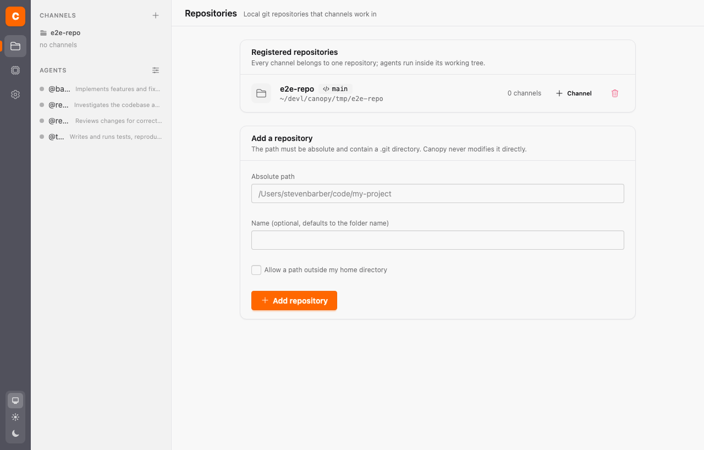
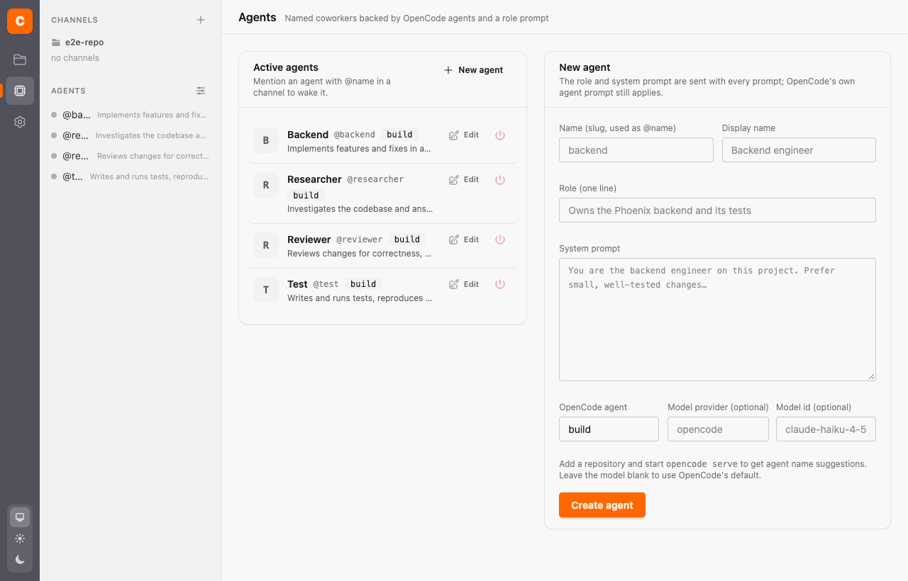
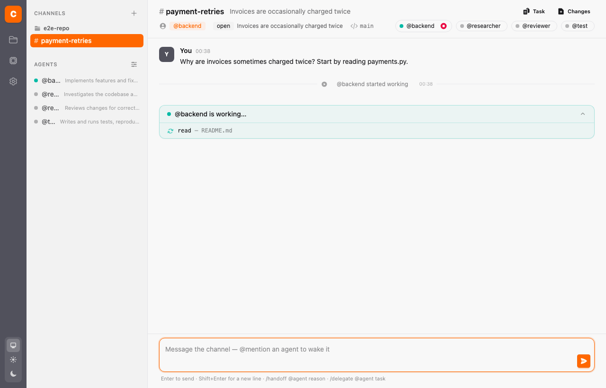
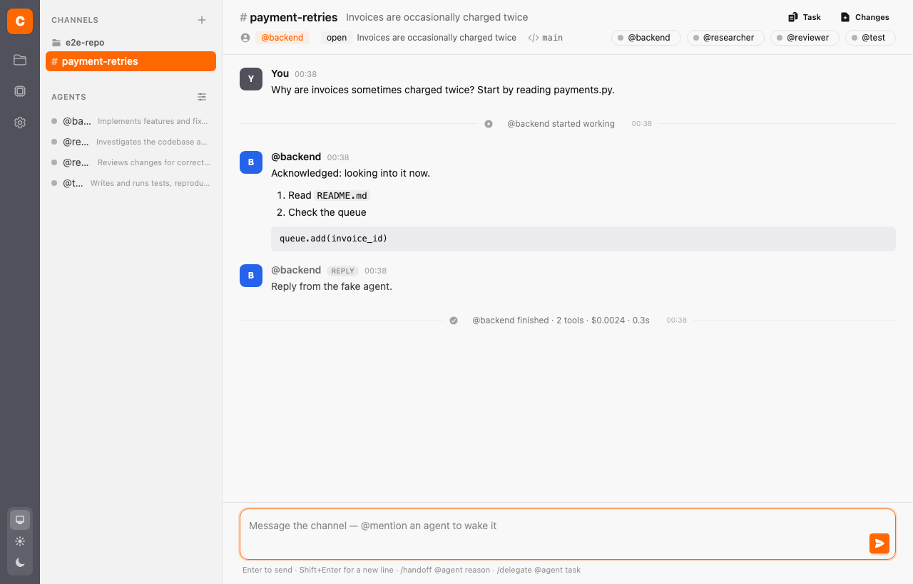
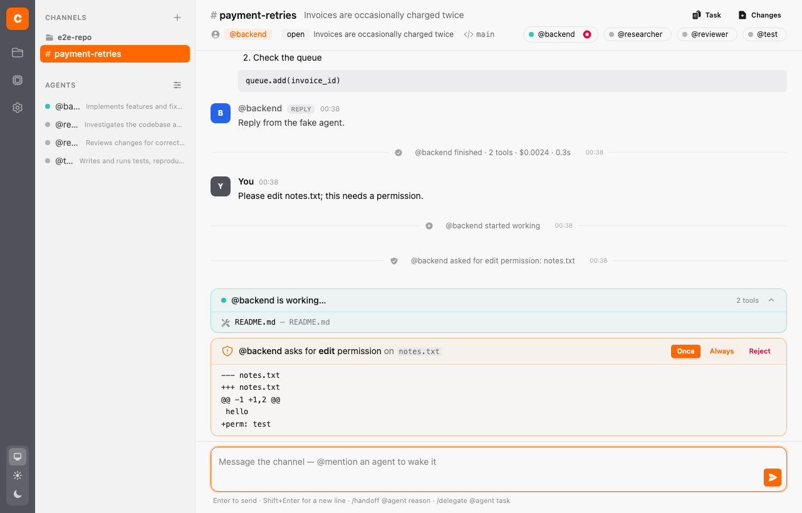
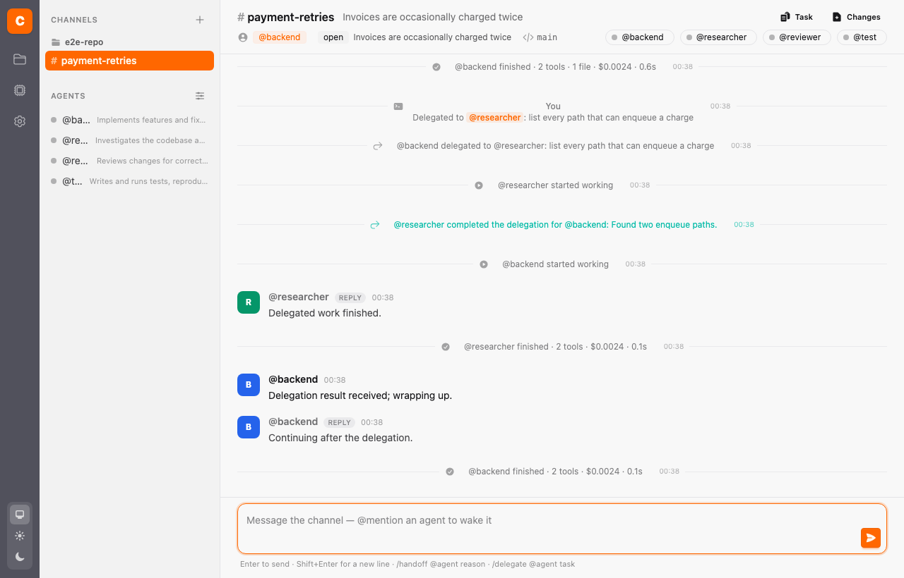
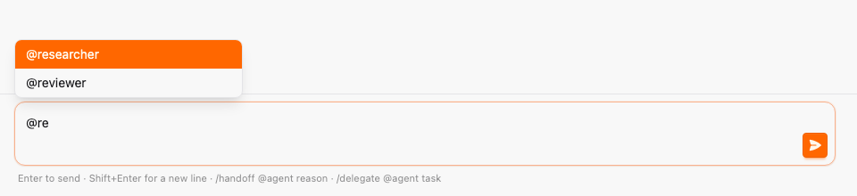

# Canopy manual testing guide

A walk through every v0 feature against a real OpenCode server. Budget about 20 minutes and
a few cents of model usage. Screenshots come from the Playwright suite's fake OpenCode, so the
agent text in them is placeholder; the screens are the real ones.

## 0. Before you start

```bash
opencode serve --port 4096        # terminal 1, leave it running
mix setup && mix canopy.demo      # once: database, seeds, demo repo + #payment-retries
mix phx.server                    # terminal 2, http://localhost:4000
```

Pick a cheap model for the test agents so a wrong turn costs nothing: on **Agents**, set
`Model provider = opencode` and `Model id = gpt-5-nano` on @backend and @researcher.
The end-to-end run in Phase 9 cost about $0.02 with that model.

## 1. Settings: connection and plugin

Open **Settings** (gear icon in the left rail).


- [ ] *Check connection* shows the OpenCode version and a green result.
- [ ] The MCP section shows the URL `http://localhost:4000/mcp` and the plugin source.
- [ ] Copy the plugin to `~/.config/opencode/plugins/canopy.js`, then **restart `opencode serve`**.
      (`mix canopy.demo` also drops it into the demo repo, which is enough for the demo alone.)
- [ ] *Rotate token* changes the masked token. Nothing else to do: Canopy re-registers on the next prompt.
- [ ] Change the display name to yours and save; it should appear on your messages later.

## 2. Repositories



- [ ] `billing-demo` is listed with branch `main`.
- [ ] Add a path that is not a git repository → inline error, nothing created.
- [ ] Add a repository outside your home directory without the checkbox → rejected; with it → accepted.

## 3. Agents



- [ ] The four seeded agents are listed with roles.
- [ ] *New agent* → the OpenCode agent field offers `build`, `plan`, … from the server (datalist).
- [ ] Create `@database` with a one-line role and a short system prompt; edit it; deactivate it;
      the inactive list shows it and *Reactivate* brings it back.

## 4. Create a channel


- [ ] Repository preselected, all active agents checked, owner limited to the chosen members.
- [ ] Uncheck the owner → the owner select falls back to another member.
- [ ] Create → you land in the channel; the sidebar shows it under the repository.


Header check: `#name`, topic, owner badge, task pill (`open`), branch, member dots (all idle).

## 5. Wake an agent and watch it work

Post, without mentioning anyone (a mention wakes the mentioned agent instead of the owner):

> Why are invoices sometimes charged twice? Read payments.py and test_payments.py, then post a
> short root-cause summary with canopy_message_send. Do not modify files.



- [ ] `@backend started working` line, owner dot turns green, an *Abort* button appears next to it.
- [ ] The **is working…** card appears closed, with a pulsing green dot. Open it with the
      chevron: it lists tools as they run (`read — payments.py`, `grep`, …) and streams
      the agent's text.
- [ ] While busy, post a second message: nothing new starts (it queues) until the turn ends.



- [ ] A normal post from @backend (sent through `canopy_message_send`) and a muted **REPLY**
      (the turn's final text).
- [ ] `@backend finished · N tools · $cost · duration` line sits above the reply and the
      dot is back to grey. Click that line: it opens to show the same activity the live
      card held. Each step and patch appears once.
- [ ] The queued second message now runs.
- [ ] Refresh the page: everything above is still there (it is durable, not a transcript view).

## 6. Permission approval

Permission cards appear when OpenCode's rules say *ask*. The default `build` agent allows
everything, so make an agent that asks: in **Agents** create `@careful` with OpenCode agent
`build`, then in the demo repo's `.opencode/opencode.json` add

```json
{ "permission": { "edit": "ask" } }
```

restart `opencode serve`, add `@careful` to the channel (Task panel → members are set at
creation; create a new channel with @careful as owner) and ask it to *append a line to notes.txt*.



- [ ] The card shows the permission (`edit`), the file pattern, and the unified diff.
- [ ] *Once* → card disappears, `permission resolved` line, the agent continues and finishes.
- [ ] Ask again and press *Reject* → the agent reports it could not edit.
- [ ] Ask again, then reply from the OpenCode TUI instead → the card still clears (event-driven).

## 7. Delegation

In the composer:

```
/delegate @researcher list every code path that can call enqueue_charge
```



- [ ] A subtle system note (`Delegated to @researcher: …`) and a `delegated` line.
- [ ] @researcher goes busy **in a child session** (its own working card), @backend stays idle.
- [ ] When the researcher calls `canopy_task_update` with a result, a `delegation completed` line
      appears with the result, and @backend wakes up with it (a second `started working` line).
- [ ] The channel task itself is unchanged: delegates never edit it.

You can also let an agent delegate: ask @backend to "use canopy_delegate_task with
to: researcher …" as in the README demo prompt.

## 8. Handoff

```
/handoff @reviewer needs a second pair of eyes on the fix
```


- [ ] A system note, a `handoff requested` line, and a pending-handoff banner with
      *Accept* / *Reject* for you.
- [ ] @reviewer wakes with the handoff id, reads it with `canopy_handoff_get`, then accepts (or
      rejects) through MCP. On accept: `owner changed` line, owner badge becomes @reviewer, and
      the previous owner is notified.
- [ ] Post a plain message now → @reviewer (the new owner) wakes, not @backend.
- [ ] Try `/handoff` with no arguments → red flash, the text stays in the composer.
- [ ] Accept a handoff yourself from the banner (useful when an agent is stuck).

## 9. Changes, task, abort


- [ ] *Changes* lists `git status` for the repository; clicking a file shows its diff.
- [ ] *Task* opens the task form; change status to `working` → `task updated` line and pill.
- [ ] Ask an agent for something slow ("run the test suite 20 times") and press *Abort* next to
      it → the turn ends with an error line and the dot goes red until the next prompt.

## 9b. Members and archiving

- [ ] **Members** in the channel header opens a panel: each member is a pill, the owner is
      marked and has no remove button. Pick an agent in the dropdown and **Add** → it appears
      in the header and the timeline says it joined. Click the × on another member → it is
      gone and the timeline says so. `@` in the composer only suggests current members.
- [ ] **Archive** (confirm the prompt) → an **archived** badge, the composer is replaced by a
      notice with a **Reopen** button, the sidebar entry is dimmed with a box icon, and
      agents' `channels_list` shows it as archived. **Reopen** brings the composer back.

## 10. Threads and mentions



- [ ] Typing `@` in the composer suggests members; Enter sends, Shift+Enter adds a line.
- [ ] Mention `@reviewer` in a message → the reviewer wakes instead of the owner.
- [ ] When an agent answers inside a thread, the reply nests under the parent with an
      "N replies" toggle.
- [ ] The sidebar has a **Direct messages** section between Channels and Agents. It lists
      every DM, including ones agents open; it updates without a reload.
- [ ] Ask an agent to "start a DM with me and @reviewer about X" → it calls
      `canopy_dm_start`; a DM titled `@agent, @reviewer` appears in the section, with the
      first message posted. A plain message from you in a group DM wakes every agent in it.
      Agents cannot open a DM that leaves you out.
- [ ] Click an agent in the sidebar's **Agents** list → a direct message opens, titled
      `@name` with a **DM** pill. The agent is its owner and only member, so a plain
      message wakes it. The row is highlighted while you are in it, and the DM never
      shows up under **Channels**. The DM belongs to the repository of the channel you
      came from (or the first repository).

## 11. Resilience

- [ ] Kill `opencode serve` mid-turn, start it again → within ~30 s the stream reconnects,
      stale turns are closed with a summary line, and the next prompt re-registers the MCP server
      (check `GET http://127.0.0.1:4096/mcp?directory=<repo path>` shows `canopy: connected`).
- [ ] Restart `mix phx.server` → channels, messages, and sessions are all still there; the next
      message reuses the same OpenCode sessions.

## Troubleshooting

| Symptom | Likely cause |
|---|---|
| Agent replies but never posts via Canopy tools; tool errors mention "unknown Canopy session" | Plugin not installed for that repository, or OpenCode not restarted after installing it |
| No agent wakes | Channel has no owner and the message mentions nobody, or the mentioned agent is not a member |
| "no expectation" / 401 in the OpenCode log for `/mcp` | Token rotated: prompt once more so Canopy re-registers |
| `hit an error: Model not found: <provider>/<model>` | The agent's model override names a provider OpenCode has no credentials for. Use a provider from `opencode providers` (or the OpenCode TUI's model list), or clear the override on the Agents page |
| Permission card never appears | The agent's OpenCode rules allow the action; see section 6 |
| `GET /permission` 400 in logs | Known OpenCode 1.18 bug for patch permissions; the card still works from the event |
