# Canopy manual testing guide

A walk through every v0 feature against a real OpenCode server. Budget about 20 minutes and
a few cents of model usage. Screenshots come from the Playwright suite's fake OpenCode, so the
agent text in them is placeholder; the screens are the real ones.

## 0. Before you start

```bash
opencode serve --port 4096        # terminal 1, leave it running
mix setup && mix canopy.demo      # once: database, seeds, demo repo + #payment-retries
mix phx.server                    # terminal 2, http://localhost:4000
```

Pick a cheap model for the test agents so a wrong turn costs nothing: on **Settings**, set
the OpenCode *Default provider* to `opencode` and *Default model* to `gpt-5-nano`; the
seeded agents have no model of their own, so they all follow it.
The end-to-end run in Phase 9 cost about $0.02 with that model.

## 0b. First-run setup

`mix canopy.demo` marks setup as done, so no setup window opens. To see it as a fresh
install does, use a scratch database:

```bash
CANOPY_DB=/tmp/canopy-fresh.db mix ecto.create
CANOPY_DB=/tmp/canopy-fresh.db mix ecto.migrate
CANOPY_DB=/tmp/canopy-fresh.db mix run priv/repo/seeds.exs
CANOPY_DB=/tmp/canopy-fresh.db PORT=4001 mix phx.server     # http://localhost:4001
```

- [ ] `/` lands on the normal home (Repositories, on a fresh database) with the setup
      window over it: the sidebar visible and dimmed behind, nothing behind it clickable
      or reachable with Tab. Open `/agents` or `/settings` directly: the window is there
      too. The name field has focus and holds your global git `user.name` (or is empty);
      a blank name is refused inline; a typed name shows *Saved* and survives a reload.
- [ ] Steps: *Next* and *Back* walk You → Look → Engines → Pace → Notifications →
      Project; the bars fill as you go and any bar jumps to its step. Type a name, jump to
      Project, type half a path, jump back and forth: both are still there. Enter on a
      step (not in a field) is *Next*; Enter in the name field saves it and moves on.
- [ ] Esc asks "Skip setup?" in the footer and focus moves to *Keep going*; Esc again (or
      *Keep going*) takes the question back. The window never closes on Esc alone.
- [ ] Palette and mode apply as you click, to the app behind the window as well, and
      survive a reload; the summary names them.
- [ ] Engines: both cards go green with versions (Claude Code also shows the login email),
      and *Default engine* has OpenCode selected. Changing a default model shows *Saved*.
      Stop `opencode serve` and press *Check again*: the OpenCode card explains how to start
      it, its model picker disappears, and *Default engine* moves to Claude Code with
      *Saved* (the Agents page shows the 13 starter agents on Claude Code, muted as the
      default). Click OpenCode, start `opencode serve`, stop it again and *Check again*:
      your pick stays.
- [ ] Default engine switch: with a channel where a starter agent has answered on
      OpenCode, choose Claude Code in Settings → Default engine, then message that agent:
      the channel shows "@… started a fresh session: its engine changed from OpenCode to
      Claude Code" and the reply comes from a Claude Code session (its transcript says so).
- [ ] Pace: *Careful* saves 3 turns on click; Settings → Conversation then shows Careful.
- [ ] Project: a plain folder under your home is added by *Add project* with the
      "initialised" note inline; *Finish setup* shows the summary in the window, and
      *Start a channel* opens New channel with it selected and no window. A reload opens
      no window either.
- [ ] At 390 px wide the window fills the screen, nothing scrolls sideways and *Next* stays
      at the foot; at 1440 it is a centred panel that keeps its height between steps. Dark
      and light both read well in every palette.
- [ ] Settings → *Run setup again* opens the window over Settings, prefilled; *Skip setup*
      closes it with "Setup skipped", Settings shows its own Appearance and Notifications
      controls again, and focus is back on *Run setup again*. An old `/welcome?step=team`
      link opens home with the window at Pace; closing it leaves no `?setup=` in the
      address.

An existing database is never sent through setup: the migration that adds `onboarded_at`
stamps a settings row that already exists. To check it, copy a database from before this
change, run `CANOPY_DB=<copy> mix ecto.migrate`, and confirm
`sqlite3 <copy> "select onboarded_at from settings"` prints a time
(`test/canopy/migrations/add_onboarded_at_to_settings_test.exs` covers the same rule).

## 1. Settings: connection and plugin

Open **Settings** (gear icon in the left rail).

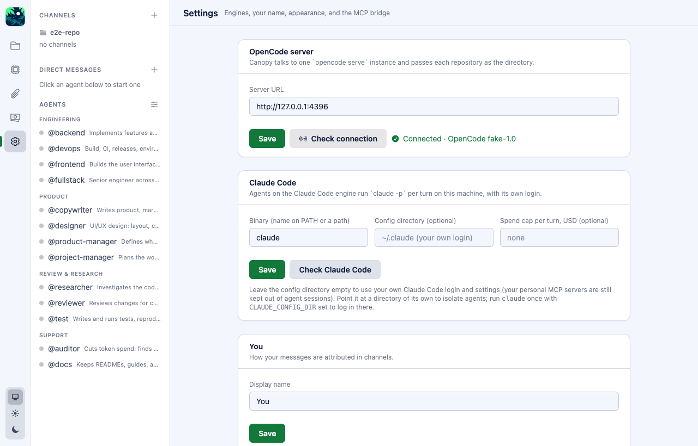

- [ ] *Check connection* shows the OpenCode version and a green result.
- [ ] The MCP section shows the URL `http://localhost:4000/mcp` and the plugin source.
- [ ] Copy the plugin to `~/.config/opencode/plugins/canopy.js`, then **restart `opencode serve`**.
      (`mix canopy.demo` also drops it into the demo repo, which is enough for the demo alone.)
- [ ] *Rotate token* changes the masked token. Nothing else to do: Canopy re-registers on the next prompt.
- [ ] Change the display name to yours and save; it should appear on your messages later.

## 2. Repositories

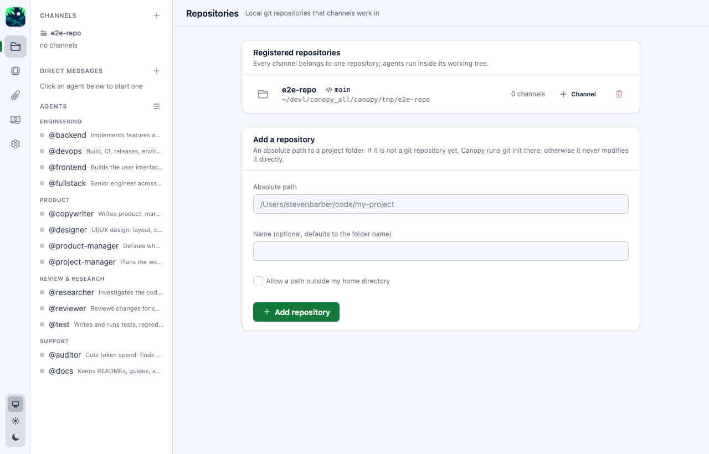

- [ ] `billing-demo` is listed with branch `main`.
- [ ] Add a path that does not exist → inline error, nothing created. Add a plain folder that
      is not a git repository → it is added and `git init` has run in it (the flash says so).
- [ ] Add a repository outside your home directory without the checkbox → rejected; with it → accepted.
- [ ] MCP page, against a real `opencode serve`: add to the repository's `opencode.json` a
      server that cannot start (`"broken": {"type": "local", "command": ["no-such-mcp"]}`)
      and one with a secret (`"environment": {"API_KEY": "sk-test-123"}`). *MCP* on the row:
      `canopy` (after an agent's first prompt, or *Re-register Canopy*) is connected,
      `broken` is failed with its error, and `sk-test-123` appears nowhere on the page.
      Fix the command, *Reconnect* → connected.
- [ ] Same page, Claude Code: add a `.mcp.json` server to the repository and run one turn of a
      Claude Code agent there. The server is listed as loaded with the turn's status and
      tool count; your `~/.claude.json` servers are under *Configured but not loaded*. Break
      the JSON → the next turn still runs, and the page shows the parse error.

## 3. Agents

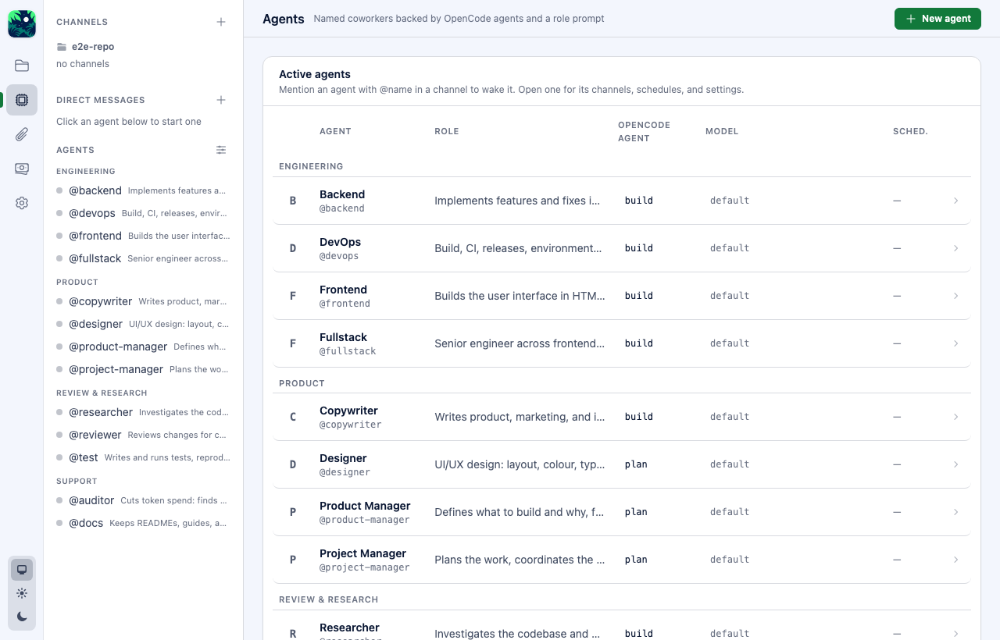

- [ ] The seeded agents are listed with roles; each row opens the agent's own page, as
      does its row in the sidebar's **Agents** list.
- [ ] *New agent* opens the create form; the OpenCode agent field offers `build`, `plan`, …
      from the server (datalist). Creating lands on the new agent's page.
- [ ] Default models: with `opencode serve` stopped, the OpenCode default selects on
      **Settings** are disabled ("Start OpenCode to choose a model"); start it and press
      *Check connection*, and they fill. Pick a default, save: the flash counts the agents
      that use it, and on **Agents** those rows read `default · opencode/gpt-5-nano`. Give
      one agent its own model from the row's picker (badge), then *Default (…)* in the same
      picker returns it. On **Settings**, *Use the default for all* clears every own model
      after a confirmation. A turn after changing the default carries the new model on its
      card, with no session reset.
- [ ] An agent's page shows status, role, model, system prompt, its channels (owned ones
      marked) and its schedules, with **Message**, **Edit**, and deactivate. Edit opens the
      form and returns to the page; deactivate marks it, the list's deactivated toggle shows
      it, and *Reactivate* brings it back.

## 3b. A Claude Code agent (engine: claude_code)

Needs Claude Code installed and logged in. On **Settings**, the *Claude Code* panel's *Check
Claude Code* button reports the version and the login. Then on **Agents**, edit @researcher:
set *Engine* to Claude Code, *Model* to `haiku`, *Effort* to `low`, *Permissions* to "approve
file edits", and save.

- [ ] Post `@researcher list the files in this repository and tell me what the project is`
      in #payment-retries. The agent's status dot goes busy within about two seconds.
- [ ] The activity card shows Claude Code's tools (`Glob`, `Read`, `Bash` with the command as
      the label) and a text preview streaming in.
- [ ] The turn card carries a cost, the model id, and a context around 20k tokens (Claude
      Code's own system prompt and tool catalogue), and the reply is posted in the channel.
- [ ] A second post to the same agent resumes the same session (it remembers the first
      answer). `ls /tmp/canopy-claude/<session id>/` holds that session's `system.md` and
      `stderr.log`.
- [ ] Abort while a turn runs: the turn ends as completed, not as an error, within a second.
- [ ] Post `@researcher post a one-line summary of the repository with canopy_message_send`:
      the reply arrives as a message posted by the agent (through the tool), not as a card recap.
- [ ] Post `@researcher run \`make\` with Bash` (anything outside git): a permission card
      appears within a few seconds with the command as its pattern. *Reject* ends the call with
      a denial the agent reports; ask again and press *Always*: the call runs, and further Bash
      calls in that session no longer prompt.
- [ ] Post `@researcher ask me whether to continue, with AskUserQuestion, then say what I chose`:
      a question card appears; pick an option; the agent's reply names it.
- [ ] Leave a permission card unanswered for 30 minutes (or set
      `config :canopy, :claude_code, prompt_timeout_ms: 20_000` in dev) and the call is denied
      "in time"; answering afterwards clears the card without an error.

## 4. Create a channel

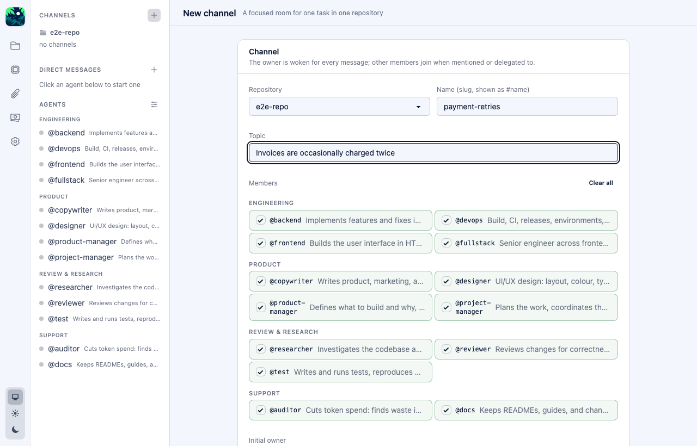

- [ ] Repository preselected, all active agents checked, owner limited to the chosen members.
- [ ] Uncheck the owner → the owner select falls back to another member.
- [ ] Create → you land in the channel; the sidebar shows it under the repository.

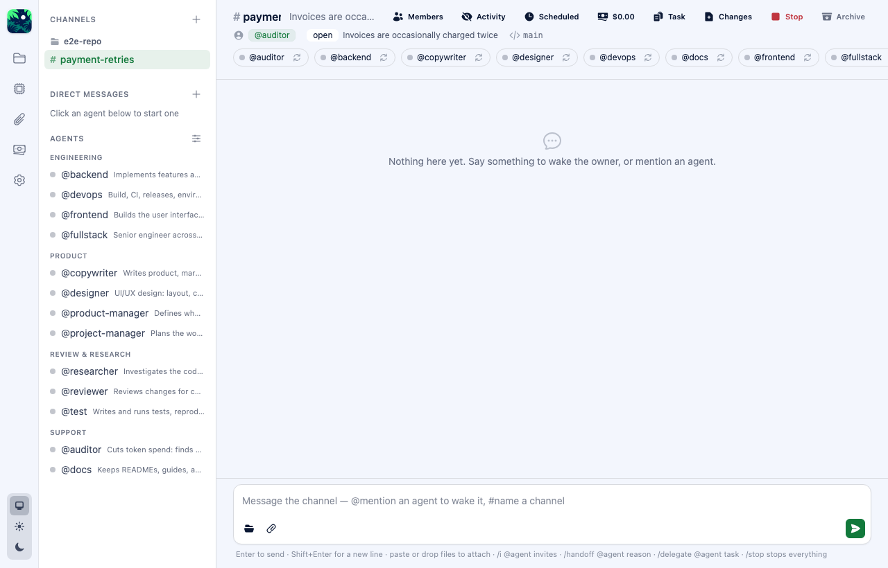

Header check: `#name`, topic, owner badge, task pill (`open`), branch, member dots (all idle).

## 5. Wake an agent and watch it work

Post, without mentioning anyone (a mention wakes the mentioned agent instead of the owner):

> Why are invoices sometimes charged twice? Read payments.py and test_payments.py, then post a
> short root-cause summary with canopy_message_send. Do not modify files.

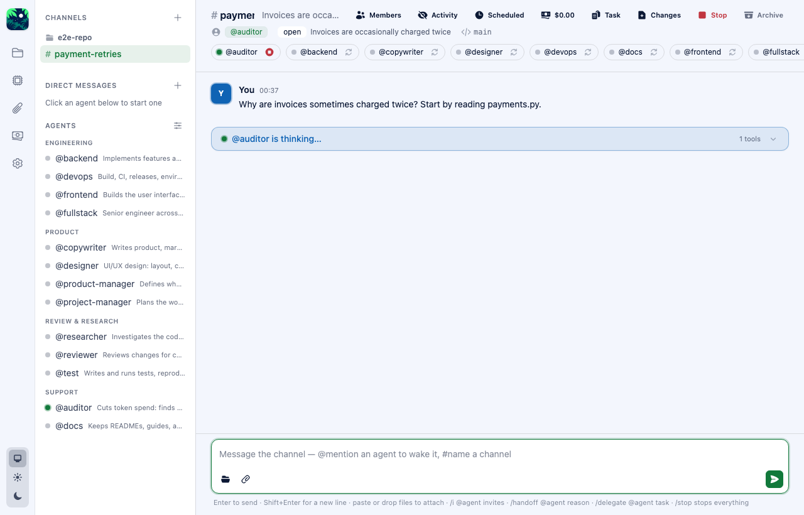

- [ ] `@backend started working` line, owner dot turns green, an *Abort* button appears next to it.
- [ ] The live card appears closed, with a pulsing green dot, and its verb follows what the
      agent is doing: *thinking* before any tool, *researching* while reading or searching,
      *building* while editing, *testing* on a test command, *writing* while posting. Closed,
      its header names the call running now, ticks the elapsed time, and counts calls by
      kind. Open it: it lists calls as they run (`Read payments.py`, `$ pytest …`), each
      with its duration, and streams the agent's text.
- [ ] Each idle member pill in the header has a small reset arrow: it drops that agent's
      OpenCode session in this channel (with confirmation), the timeline says so, and the
      agent's next turn starts with a fresh context. Use it when an agent has talked itself
      into a corner, such as insisting its tools are missing.
- [ ] While busy, post a second message: nothing new starts (it queues) until the turn ends.

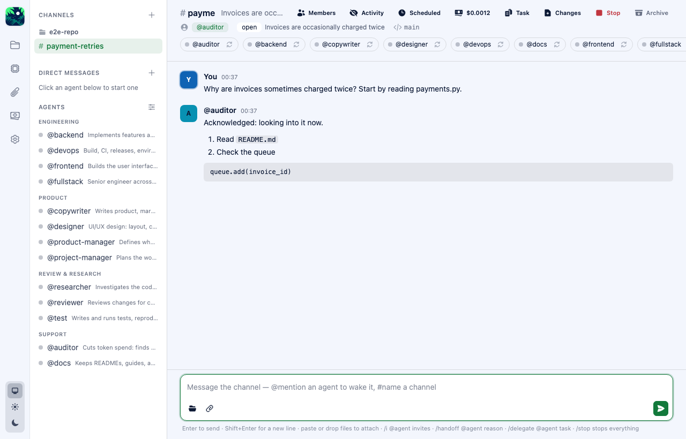

- [ ] A normal post from @backend (sent through `canopy_message_send`). Its closing text is
      not posted again: open the finished line and it is there as a **Closing note**. A turn
      that posts nothing through the tools still ends with a muted **REPLY** message.
- [ ] The timeline is compact by default: "started working", clean "finished" lines, and
      scheduled fires are hidden. The **Activity** toggle in the header shows them, and the
      browser remembers the choice. Errors, passes with a note, and anything you can act on
      always show.
- [ ] With the feed scrolled to the bottom, an agent's new message scrolls into view on its
      own; scrolled up to read history, the feed stays put.
- [ ] (With Activity shown) the `@backend finished · N tools · $cost · duration` card sits above the reply and the
      dot is back to grey, left-aligned in the same box the live card was. Click it: it
      opens to show the same activity the live card held. Patches add file chips, not rows.
- [ ] In the compact timeline, @backend's post carries a `⚙ N tools · time` receipt chip
      that opens the turn's activity in the side panel.
- [ ] The queued second message now runs.
- [ ] Refresh the page: everything above is still there (it is durable, not a transcript view).

## 5b. Activity cards

Ask for something that runs a failing command, for example *"run the test suite and fix
what fails"*, on an OpenCode agent and again on a Claude Code agent.

- [ ] Rows show durations; commands show `exit N` (OpenCode always; Claude Code when its
      failed result starts with `Exit code N`: note what the current `claude` prints, the
      format is not verified yet). A failed command's row is tinted red and keeps its
      command; opening it shows the error first, then the command and the output tail.
- [ ] Open the live card, then let the turn end: the finished card arrives open, with the
      rows you had open still open.
- [ ] Filters: *Errors* narrows to the failing rows; the text box filters by command or
      path; Esc in it clears it; new rows arriving while a filter is set are filtered too.
- [ ] Follow: on a long turn, the open live card keeps the newest row in view; scroll up and
      a *↓ N new rows* pill appears; click it to jump back.
- [ ] Copy on a command copies it; on a cut output the button says *Copy (excerpt)*.
- [ ] A file chip opens Changes on that file's diff.
- [ ] ⤢ opens the side panel (`?activity=…`); reload keeps it; the link opens it in a new
      tab; Esc closes it; opening a thread closes it, and the other way round. A running
      turn's panel moves to the finished turn when it ends.
- [ ] At phone width (390 px) the card has no sideways scroll and the panel is a
      full-screen overlay with Back.
- [ ] Keyboard only: Tab reaches the card header, the filters, then the rows; Enter opens
      a row; focus rings are visible.
- [ ] A turn of more than 60 calls keeps its first rows on the finished card, and its
      header counts match the rows.
- [ ] Claude Code: the live card shows tokens and no cost; the finished card has the cost.

## 5c. Session transcript

Do this on an OpenCode agent and again on a Claude Code agent.

- [ ] The document icon on the agent's member pill opens its transcript: the prompts Canopy
      sent, the collapsed system prompt (Claude Code also shows its built-in sections), the
      model's text, tool rows that open to input and output, and step lines. Claude Code
      shows its thinking as muted *Thought* rows with no text.
- [ ] *View in transcript →* in an opened turn card, and the transcript icon in the
      activity side panel, land on that turn, its divider highlighted.
- [ ] Ask the agent to `cat` its MCP config (Claude Code: the `mcp.json` in its scratch
      dir; any agent: echo a fake `sk-ant-…` key): the tool row shows `[canopy session
      token]` / `••••` and a *redacted* chip; no token text in the page source.
- [ ] *Follow live* on a working agent: new entries arrive without a reload; with Follow
      off a *↓ N new entries* pill appears.
- [ ] A compacted session (wait for *session was compacted*, or `/compact` a Claude Code
      session) shows the *Context compacted* band with its summary; earlier entries stay
      above it.
- [ ] Reset the session from the pill (the confirmation names the agent's own engine),
      then follow *earlier transcript* on the reset line; after the next turn, the session
      picker lists the reset session and switches to it.
- [ ] On the agent's page, *Transcript* next to each channel opens the same page.
- [ ] At phone width (390 px) the page has no sideways scroll; long output scrolls inside
      its box.

## 6. Permission approval

Permission cards appear when OpenCode's rules say *ask*. The default `build` agent allows
everything, so make an agent that asks: in **Agents** create `@careful` with OpenCode agent
`build`, then in the demo repo's `.opencode/opencode.json` add

```json
{ "permission": { "edit": "ask" } }
```

restart `opencode serve`, add `@careful` to the channel (Task panel → members are set at
creation; create a new channel with @careful as owner) and ask it to *append a line to notes.txt*.

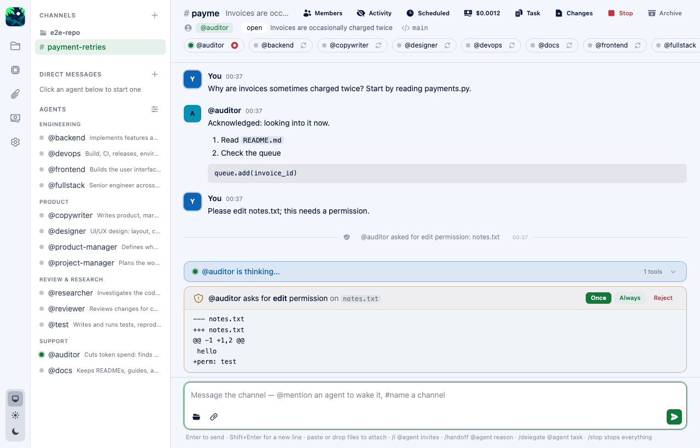

- [ ] The card shows the permission (`edit`), the file pattern, and the unified diff.
- [ ] *Once* → card disappears, `permission resolved` line, the agent continues and finishes.
- [ ] Ask again and press *Reject* → the agent reports it could not edit.
- [ ] Ask again, then reply from the OpenCode TUI instead → the card still clears (event-driven).

## 7. Delegation

In the composer:

```
/delegate @researcher list every code path that can call enqueue_charge
```

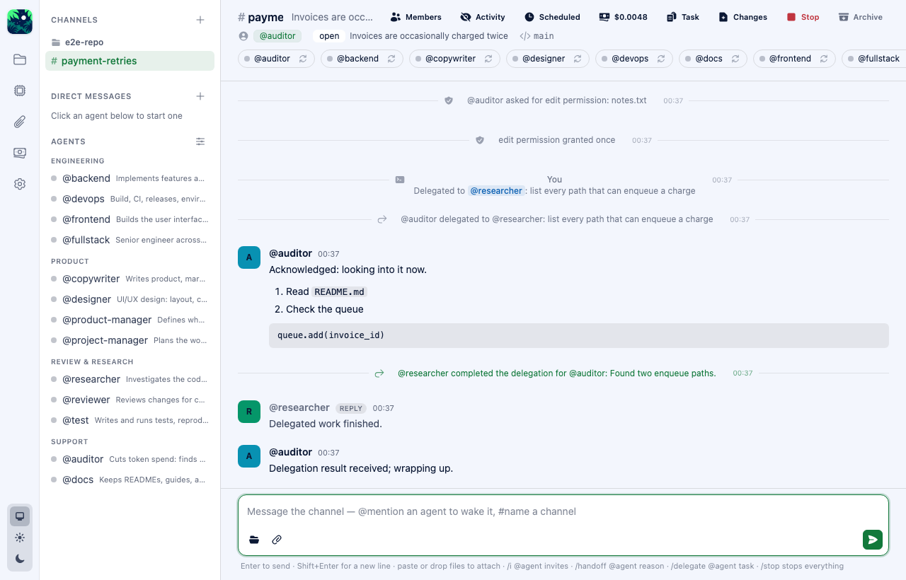

- [ ] One line for it: `Priya delegated to @researcher for @backend: …` (no separate note).
- [ ] @researcher goes busy in its own channel session (its working card), @backend stays idle.
- [ ] When the researcher calls `canopy_task_update` with a result, a `delegation completed` line
      appears with the result, and @backend wakes up with it (a second `started working` line).
- [ ] The channel task itself is unchanged: delegates never edit it.

You can also let an agent delegate: ask @backend to "use canopy_delegate_task with
to: researcher …" as in the README demo prompt.

## 8. Handoff

```
/handoff @reviewer needs a second pair of eyes on the fix
```

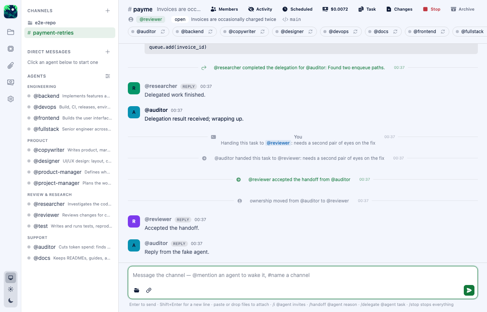

- [ ] A system note, a `handoff requested` line, and a pending-handoff banner with
      *Accept* / *Reject* for you.
- [ ] @reviewer wakes with the handoff id, reads it with `canopy_handoff_get`, then accepts (or
      rejects) through MCP. On accept: `owner changed` line, owner badge becomes @reviewer, and
      the previous owner is notified.
- [ ] Post a plain message now → @reviewer (the new owner) wakes, not @backend.
- [ ] Try `/handoff` with no arguments → red flash, the text stays in the composer.
- [ ] Accept a handoff yourself from the banner (useful when an agent is stuck).

## 9. Changes, task, abort

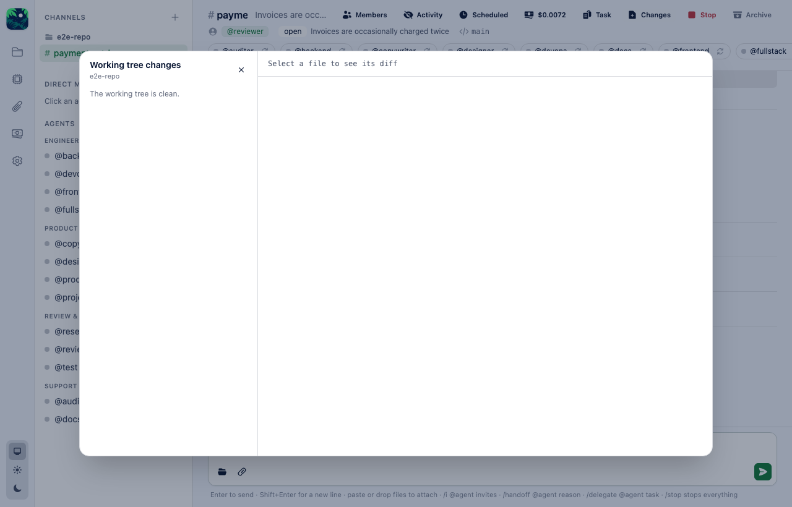

- [ ] *Changes* lists `git status` for the repository; clicking a file shows its diff.
- [ ] *Task* opens the task form; change status to `working` → `task updated` line and pill.
- [ ] Ask an agent for something slow ("run the test suite 20 times") and press *Abort* next to
      it → the turn ends with an error line and the dot goes red until the next prompt.

## 9b. Members and archiving

- [ ] **Members** in the channel header opens a panel: each member is a pill, the owner is
      marked and has no remove button. Pick an agent in the dropdown and **Add** → it appears
      in the header and the timeline says it joined. Click the × on another member → it is
      gone and the timeline says so. `@` in the composer only suggests current members.
- [ ] **⋯** → **Archive** (confirm the prompt) → an **archived** badge, the composer is replaced by a
      notice with a **Reopen** button, the sidebar entry is dimmed with a box icon, and
      agents' `channels_list` shows it as archived. **Reopen** brings the composer back.

## 9c. Teams

- [ ] **Agents → Teams → New team**: name `qa-team`, tick two agents → the lead select offers
      only them and picks the first. Try the name of an existing agent → "is already an
      agent's name". Save → the team is listed with its members and the lead marked.
- [ ] **Edit** the team and untick the lead → "choose a new lead before removing the current
      one"; pick the other member as lead and save.
- [ ] **New channel** on the team's row → only its members are ticked and the lead is the
      owner. On the plain new-channel form, a team chip and a group heading each tick (and,
      pressed again, clear) their agents.
- [ ] In a channel without the team, **Members → Invite a team…** → one `@qa-team joined: …`
      line, new pills, nobody wakes, the owner is unchanged.
- [ ] In another channel, `/i @qa-team check the login page` → the team joins, the message
      mentions it, and both members wake. `/i @qa-team` again → "everyone on @qa-team is
      already in #…". Typing `@qa` in the composer suggests the team.
- [ ] Mention the team in a channel where its members are not → the hint says `/i @qa-team`.
- [ ] Deactivate one member → it shows greyed on the Teams page and is skipped the next
      time the team is added or mentioned.

## 10. Threads and mentions

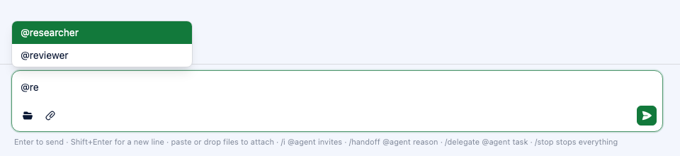

- [ ] Typing `@` in the composer suggests members; Enter sends, Shift+Enter adds a line.
- [ ] Type `@backend see #<channel> and @nobody` → `@backend` and the channel get chips,
      `@nobody` stays plain. Remove @reviewer from the channel and type `@reviewer` → a
      dashed underline; add it back without touching the draft → it turns into a chip.
- [ ] `` `@reviewer` `` and a fenced block holding `@reviewer` get no chip, and sending
      them wakes nobody.
- [ ] Type 30 lines and scroll the composer: the chips stay on their words. Resize the
      window and switch to dark mode: still aligned, and the chips are readable.
- [ ] Click **Reply** on a message and type `/i @reviewer` in the thread panel's composer →
      `/i` gets a red wavy underline; the same text in the channel's composer is a command.
- [ ] Mention `@reviewer` in a message → the reviewer wakes instead of the owner.

- [ ] Hover a message (on a touch screen the actions are always shown) → **Reply** and a
      link icon. **Reply** opens the thread in a panel on the right (full screen with
      **Back** on a phone-sized window); the URL gains `?thread=msg_…` and the root gets a
      green bar in the feed.
- [ ] Reply in the panel → it lands in the thread, not the feed, and the composer stays in
      the thread for the next reply. The feed's summary row under the root shows the
      avatars, the count, and "last reply …".
- [ ] The owner (or the agent that replied last in the thread) wakes: its live card shows
      in the panel, the summary row says "@backend is replying…", and its answer and its
      "finished" line stay in the thread. With the panel closed, only the summary row shows
      the work.
- [ ] Tick **Also send to #channel** and reply → the reply is in the thread and in the
      feed, where it says "replied to a thread: …"; the box is unticked afterwards.
- [ ] Copy a thread's link (the link icon), open it in a new tab → the panel opens there,
      also for a thread older than the loaded feed. `?thread=msg_nonsense` shows "That
      thread is not in this channel." and no panel.
- [ ] Esc in the panel with an empty box closes it; with a draft it does nothing.
- [ ] An agent's unaddressed reply in a thread wakes the agent that replied before it there
      (else the one that started it), never the owner.
- [ ] Reply in a thread, close the panel before the agent answers → the summary row gets a
      "new" dot and the rail's **Threads** icon a badge; the channel itself does not turn
      bold (a thread-only reply counts only if it mentions you). Opening the thread clears
      both. The bell in the panel unfollows: new replies then leave the badge alone.
- [ ] The rail's **Threads** page lists followed threads (with their last two replies and
      the unread count), **All active** lists every thread with a reply this week, and
      **Agents working** the threads an agent is in right now. **Open thread** goes to the
      channel with the thread open.
- [ ] The sidebar has a **Direct messages** section between Channels and Agents. It lists
      every DM, including ones agents open; it updates without a reload. Its **+** opens a
      modal over the current page to pick one or more agents (and a repository if you have
      several); opening the same set again returns to the existing DM.
- [ ] Ask an agent to "start a DM with me and @reviewer about X" → it calls
      `canopy_dm_start`; a DM titled `@agent, @reviewer` appears in the section, with the
      first message posted. A plain message from you in a group DM wakes every agent in it.
      Agents cannot open a DM that leaves you out.
- [ ] Click an agent in the sidebar's **Agents** list → the Agents page opens with that agent
      selected: its row is highlighted and offers **Message** and **Edit**. **Message** opens
      (or creates) your direct message with it.
- [ ] Open a DM from a row in **Direct messages** → it is titled
      `@name` with a **DM** pill. The agent is its owner and only member, so a plain
      message wakes it. The row is highlighted while you are in it, and the DM never
      shows up under **Channels**. The DM belongs to the repository of the channel you
      came from (or the first repository).

## 10a. Agents creating channels

- [ ] In a DM with two repositories registered, the header shows a repository dropdown. Switch
      it → "moved this conversation to …" on the timeline, the sidebar tag changes, and the
      agent's next turn runs in the new repository (its old session is dropped once idle).
      Asking the agent to "work in calculator_app from now on" does the same through
      `canopy_dm_switch_repository`.
- [ ] With two repositories registered, an agent's prompt names the other one; ask it to
      "start a channel in calculator_app" → `canopy_channel_create` with `repository:` puts
      the channel there, and the agent's session in that channel runs in that directory.
- [ ] Ask an agent to "create a channel called retry-backoff with @reviewer and post a plan"
      → it calls `canopy_channel_create`; the channel appears under **Channels** right away,
      the agent is its owner, @reviewer is a member, and the first message is there.
- [ ] Ask any member to add @test → `canopy_channel_add_members` adds it and the timeline says
      it joined. Ask the owner to remove @test → `canopy_channel_remove_members` removes it;
      ask a non-owner to remove someone → refused. The owner cannot remove itself.

## 10b. Keeping the conversation going

- [ ] An agent posts without mentioning anyone (ask @reviewer to "post your opinion, don't
      tag anyone") → the owner wakes anyway and answers. The owner's own unaddressed posts
      wake nobody, so it does not loop.
- [ ] Post "thanks, all good" → the owner wakes, calls `canopy_pass`, and the timeline shows
      `@backend passed` with no reply message. Acknowledgements no longer bounce between
      agents: an automatic reply (the muted **REPLY** message) wakes only who it mentions.
- [ ] Hover an agent's post → **React** (the smiley) → ✅ → a "✅ 1" chip, highlighted;
      nobody starts working and the sidebar shows nothing new. Click the chip → it goes. React
      on a thread reply in the panel → the chip shows there. A reaction while the channel is
      paused leaves it paused.
- [ ] Ask the owner "@backend react if you saw this, nothing else" → it calls `canopy_react`
      and `canopy_pass`: a ✅ from @backend on your message (hover for the name), no reply.
      React ✅ on one of its older posts, then ask it to read the channel → its
      `canopy_messages_read` ends with "Reactions since your last read".
- [ ] Mention two agents in one message → only one starts; the other's dot turns amber
      (queued) and it starts when the first finishes. Settings → **Conversation** has the
      "one agent at a time" switch; off, both start together.
- [ ] Settings → **Conversation** sets the number of turns, or turns pausing off entirely for
      long-running work (the paused bar and note follow the number you set).
- [ ] Let agents talk among themselves for six turns without typing → a "Paused after 6
      agent turns without you" note lands on the timeline, a bar appears above the
      composer, and nothing else starts. **Continue** runs what was held; typing anything
      also resets the budget.

## 10i. Locks

- [ ] Ask @backend to run the test suite → it calls `canopy_lock_acquire` before `mix test`;
      the header shows a `tests · @backend · <1m` chip while it runs, and the chip is gone
      when its turn ends (Activity view: `@backend's turn ended, releasing the tests lock`).
- [ ] While @backend holds it, ask @frontend to run the suite too (Settings → Conversation:
      one agent at a time off, or a second channel on the same repository) → the timeline
      shows `@frontend is waiting for the tests lock held by @backend (1st in line)`, the
      chip reads `next: @frontend`, and @frontend ends its turn without running anything.
      When @backend's turn ends, `the tests lock passed to @frontend` appears and @frontend
      wakes on its own and runs the suite. Nobody posts "lock released".
- [ ] A holder that asks you a question keeps its lock; the chip gets a blue dot and the
      panel says "waiting on you". Answer the card; when its turn ends, the lock passes on.
- [ ] Click the chip → the panel lists holder, reason, age and the line. **Force release**
      (with a confirmation) passes the lock to the next in line, who is woken.
- [ ] Take a lock yourself from the panel ("testing by hand") → agents that ask for it
      queue behind you; **Release** wakes the first of them.
- [ ] Reset the holder's session, remove it from the channel, or press **Stop** → its locks
      and places in line go, and the next waiter is woken.
- [ ] Restart `mix phx.server` while an agent waits for a lock → the turn holding it is gone,
      so the waiter is woken with the lock shortly after boot.

## 10e. Scheduled tasks

- [ ] Tell an agent "remind me in 2 minutes to check the deploy" → it calls
      `canopy_schedule_create`; the timeline shows `@agent scheduled: once · …`, the header's
      **Scheduled** button gets a count, and the panel lists it with "in 2m".
- [ ] Two minutes later: `scheduled task fired for @agent` appears and the agent takes a
      turn with that instruction (it posts, or passes).
- [ ] Ask for a repeat ("every weekday at 9") → the panel shows `every weekday at 09:00`;
      cancelling from the panel or the Agents page records `cancelled a schedule`.
- [ ] Open the agent on the Agents page → **Scheduled for @agent** lists schedules across
      channels with links; the sidebar row shows a clock with the count.
- [ ] Restart `mix phx.server` with a schedule pending → it still fires on time.

## 10j. Playbooks

- [ ] **Playbooks** (rail) lists **bug-fix** marked *starter*, enabled. **New playbook**
      opens the editor with a template; break the frontmatter (`name: Bad_Name`) → the reasons
      show under the textarea and the step preview empties. Fix it → the preview lists the
      steps with owners, a *your sign-off* badge on an `approval: user` step, and a warning
      for a `## section` that matches no step. Save.
- [ ] **Teams → Edit @bugfix-team**: give `@frontend` the role `fix` → the Teams page shows
      `@frontend · fix`.
- [ ] In a channel, "@project-manager run the bug-fix playbook: the checkout button does
      nothing on Safari" → it calls `canopy_playbook_start`; a new channel
      (`#bug-fix-the-checkout-button-does…`) appears, owned by @project-manager, with
      `@bugfix-team joined` and the task titled from the brief, and @project-manager wakes
      there with the brief and the triage step. The header chip reads `bug-fix · 1/6 Triage
      and scope`; the sidebar row shows a small book.
- [ ] Watch it go: delegations made now say "requested for step `reproduce`", the delegate's
      wake says which step it is, the timeline shows `bug-fix: Reproduce … done → Fix
      (@backend, @frontend)`, and the chip follows. Click the chip → the panel shows every
      step's status, round, result, and delegations.
- [ ] Ask @test (not the coordinator) to advance the run → `canopy_playbook_advance` refuses:
      only @project-manager can. Ask the coordinator to skip sign-off, or to jump past it
      (`next:` a later step) → refused: it needs your approval.
- [ ] At sign-off: the chip turns amber ("waiting for you"), the timeline says `bug-fix is
      waiting for your sign-off`, the sidebar shows a "needs you" badge. **Request changes**
      with a note → the coordinator wakes with the note and goes back to a step. Later,
      **Approve** → `the bug-fix playbook is complete`, the chip goes, and the panel lists the
      run as completed. With the chatter budget used up, Approve still wakes the coordinator.
- [ ] Start a run yourself: **Playbook** in a channel header (or **Start…** on the Playbooks
      page) → pick the playbook, a coordinator, a brief → the coordinator wakes with it.
      `/playbook bug-fix @backend the login form loses its input` does the same from the
      composer. A second start in the same channel is refused ("already has a playbook run in
      progress").
- [ ] Accept a handoff from the coordinator to another agent → `bug-fix: coordinator
      @project-manager → @backend (it followed the handoff)`. **Reassign** in the panel does
      the same by hand; **Cancel run** ends it.
- [ ] Edit a playbook while a run of it is in progress → the run's panel says the playbook was
      edited since it started; the run keeps its steps. **Delete** is refused while it runs.
- [ ] Stall nudge: write a playbook with `stall_after: 1m`, start it, and let the step sit →
      about a minute later `… has been on … for 1 min with no activity; nudged @agent`, and the
      coordinator wakes once. Nothing more until something happens on the run.
- [ ] Ask an agent to write a playbook → it calls `canopy_playbook_save`; the library shows
      it disabled, *draft by @agent*, and it cannot be started until you enable it.

## 10k. GitHub watches

Needs the GitHub CLI (`gh auth login` done) and a repository with a GitHub remote. Use a
repository you own; watches only read.

- [ ] **Settings → GitHub → Check gh** → `gh 2.x · logged in as <you>`. Point the binary at a
      path that does not exist → the check says gh is not installed.
- [ ] "@devops watch for new issues labelled bug here and triage each one" → it calls
      `canopy_watch_create`; the Scheduled panel lists `watching new issues labelled bug in
      owner/repo · every minute · checked now`, and the timeline records it. Nothing fires for
      issues that already exist.
- [ ] Open an issue with that label on GitHub → within a minute or two a channel note lists it
      ("GitHub watch … found 1 new item"), `a watch found 1 new item for @devops (…)` appears,
      and @devops wakes with the issue's number, title, and URL (marked as external data).
      Edit the issue → nothing fires again.
- [ ] With nothing new, the watch's *checked* time moves each minute and nothing else
      happens: no timeline line, no turn, no spend.
- [ ] A watch with `playbook: bug-fix` → each new item starts a bug-fix run (in a new channel),
      @devops coordinating; the run panel says it was started by a GitHub watch.
- [ ] Log gh out (`gh auth logout`) → the watch shows "gh is not logged in…" in red; after
      three failed checks it pauses with the reason. Log back in; cancel it and ask for a new
      one.

## 10f. Agent memory

- [ ] An agent's page has a **Memory** panel, empty at first. Tell the agent something
      lasting ("remember that I prefer small PRs") → it calls `canopy_memory_write` and the
      panel updates without a reload, with an "updated …" stamp.
- [ ] Open a channel in a *different* repository and ask the agent what it knows → the
      memory is in its prompt, so it answers without re-learning.
- [ ] **Edit** on the panel lets you curate the memory by hand.

## 10d. Shared repository notes

- [ ] After adding a repository, `.canopy/README.md` and `.canopy/NOTES.md` exist in it, and
      `.git/info/exclude` lists `.canopy/`.
- [ ] Ask an agent to "add to the repository notes that tests run with `mix test`" → it
      calls `canopy_notes_write` and a dated `## YYYY-MM-DD` entry appears under the header
      in `.canopy/NOTES.md`; the Changes modal and the "files changed" count ignore it.
- [ ] Wake a *different* agent in the same repository and ask how to run the tests → the
      notes are in its prompt, so it answers without looking.
- [ ] Edit `.canopy/NOTES.md` by hand → the next prompt carries your edit.

## 10c. Unread marks

- [ ] Open a different channel and have an agent post in the first one → the first channel's
      name in the sidebar turns bold with a small dot. Hover it for the count.
- [ ] Have an agent mention you (`@` + your display name) there → the dot becomes a filled
      badge with the number of mentions. Open the channel → both clear.
- [ ] A reply that stays in a thread does not make the channel bold, unless it mentions you;
      one also sent to the channel does.

## 10l. Command palette

- [ ] macOS: ⌘K opens the palette from any page with a sidebar, also with the caret in the
      composer; Ctrl+K in the composer still deletes to the end of the line. Linux or
      Windows: Ctrl+K opens it and the browser's search box does not take the key.
- [ ] Type part of a channel name and press Enter → you land there; reopen elsewhere and it
      heads *Recent*.
- [ ] Open a thread, press ⌘K, then Esc → the palette closes and the thread panel stays,
      with the caret back in its composer.
- [ ] In a channel, `/delegate` then Enter → the composer reads `/delegate @` with the agent
      list open. On Settings, `/stop` then a channel → a "Stopped #name" flash, and you stay
      on Settings.
- [ ] On a phone (or a 390 px window): open the menu, tap *Jump to…* → the drawer closes and
      the palette fills the width; typing does not zoom the page.
- [ ] Dark mode: the palette, its active row, and the mode chip read clearly.

## 10m. Search

- [ ] Click the rail's magnifier and type part of a word from a recent message → results
      appear while you type, the word highlighted, and the URL carries `?q=`.
- [ ] Search a path an agent changed (`README.md`) → its turn shows with the path
      highlighted; it opens in the channel's activity panel.
- [ ] Each filter (Channel, From, Date with a custom range, Archived, Sort) and each tab
      changes the URL and the results; reload the page → the same search comes back.
- [ ] Open a message older than the loaded feed (a long channel) → the channel opens on it,
      flashed, with **Jump to latest** above the composer; post from another tab → the pill
      counts it and the feed stays put; click the pill → back at the bottom with the new
      message.
- [ ] A thread reply opens its thread at the reply; a file opens in a new tab.
- [ ] ↑/↓ then Enter in the search box opens a result; Esc clears the box.
- [ ] On a phone (390 px): the filters fold behind **Filters (n)**; no sideways scroll.
- [ ] In the command palette, type a word no channel has → Shift+Enter opens Search with it.

## 10h. Lean context

- [ ] Post a short message → the agent's finished line shows no `canopy_messages_read` call
      (the text was already in its wake prompt).
- [ ] Ask an agent to read the channel twice in a row → the second read answers "nothing new
      since your last read". A long message comes back shortened with a pointer to
      `canopy_message_get`.
- [ ] After a long turn (over 40k tokens of context) a "session was compacted" line appears
      with Activity on, and the next turn is cheap again on the Costs page.

## 10g. Costs and the billing hold

- [ ] The rail's **Costs** page shows today / 7 days / all-time totals, a 14-day bar, and
      by-agent, by-channel (linked), by-model breakdowns; the period buttons switch the
      breakdowns and a finishing turn updates the numbers without a reload.
- [ ] Make OpenCode report a balance error (or engage the hold from `iex` with
      `Canopy.Hold.engage("test")`) → a red banner on every page, all schedules paused, and a
      message in a channel adds one "on hold" note and wakes nobody. **Release hold** in the
      banner clears it, resumes those schedules, and the next message wakes agents again.
- [ ] Message and event times show in your local time.
- [ ] **Where the tokens go** shows model calls, context per call, cache hit rate, prompt and
      output tokens, passed and error turns; **By trigger** groups spend by what woke the
      agent; **Costliest turns** lists single turns with links to their channel.
- [ ] **Auditor**: pick an agent, type a focus, press **Ask @agent to audit** → you land in a
      DM with it; the agent calls `canopy_costs_report` and replies with recommendations.
- [ ] **Spend limit**: on a channel, open the Budget button (shows spent / limit), set $1
      → the sidebar Costs page lists it under **Channel spend limits**. Once the channel's turns
      pass $1, a red bar says the limit is reached and messages wake nobody; **Change limit**
      → raise it → the next message wakes the agent again. Ask an agent to create a channel
      "with a $2 spend limit" → the limit is set; ask it to change it → it cannot.

## 11. Resilience

- [ ] Kill `opencode serve` mid-turn, start it again → within ~30 s the stream reconnects,
      stale turns are closed with a summary line, and the next prompt re-registers the MCP server
      (check `GET http://127.0.0.1:4096/mcp?directory=<repo path>` shows `canopy: connected`).
- [ ] Restart `mix phx.server` → channels, messages, and sessions are all still there; the next
      message reuses the same OpenCode sessions.
- [ ] Restart `opencode serve` instead → the next message in an already-open channel still
      has the `canopy_*` tools (Canopy re-registers its MCP server after the reconnect).

## Troubleshooting

| Symptom | Likely cause |
|---|---|
| Agent replies but never posts via Canopy tools; tool errors mention "unknown Canopy session" | Plugin not installed for that repository, or OpenCode not restarted after installing it |
| No agent wakes | Channel has no owner and the message mentions nobody, or the mentioned agent is not a member |
| "no expectation" / 401 in the OpenCode log for `/mcp` | Token rotated: prompt once more so Canopy re-registers |
| `hit an error: Model not found: <provider>/<model>` | The agent's model, or the OpenCode default in Settings it inherits, names a provider OpenCode has no credentials for. Use a provider from `opencode providers` (or the OpenCode TUI's model list), on the Agents page or in Settings |
| Permission card never appears | The agent's OpenCode rules allow the action; see section 6 |
| `GET /permission` 400 in logs | Known OpenCode 1.18 bug for patch permissions; the card still works from the event |
